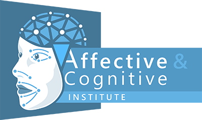

# BMBF Projekt *LLM-Praxis*

Laufzeit: 10/24 - 9/28

## Projektbeschreibung
Im Kontext von LLMs, wie bei der Einführung vieler anderer disruptiven Technologien, ergeben sich vielfältige wissenschaftliche, technologische, juristische und gesellschaftliche Fragestellungen von große Breite und Tiefe, welche unfraglich ausnahmslos von großer Bedeutung sind, aber unmöglich alle in einem Projekt behandelt werden können. Daher wird sich das vorgeschlagenen Projekt sowohl technologisch, als auch bei der Betrachtung der Technologiefolgen und Rahmenbedingungen auf wenige Kernthemen beschränken, welche in der Frühphase der Erprobung und Entwicklung von LLM Lösungen beim KMUs von hoher praktische Bedeutung sind und Risiken bezüglich anderer Aspekte minimieren.

Im Rahmen von LLMpraxis sollen explizit keine neuen GPT Algorithmen erforscht oder Modelle von Grund auf entworfen oder trainiert werden. Stattdessen soll auf das inzwischen breite Angebot an (unter offenen Lizenzen verfügbaren) sogenannten Foundation-Models  und Open Source Frameworks zurückgegriffen werden, um diese dann an die Anforderungen realer Anwendungen bei den vier Partnerunternehmen anzupassen und produktiv einzusetzen. Neben vielen praktischen Fragestellungen bezüglich des Hostings, APIs zu bestehender Software und der Skalierbarkeit von LLM-Deployments für wachsende Nutzerzahlen auf eigenen lokalen Systemen, soll der wissenschaftliche Fokus im Rahmen einer projektbegleitenden Promotion auf Fragestellungen zur Beschränkung von LLMs auf eigene Daten und deren korrekten Referenzierung (Quellenangabe) liegen. 

Das Herzstück des Projekts ist die anwendungzentrierte Vorgehensweise: gemeinsam mit vier Partnerfirmen wurden fünf konkrete Anwendungen in den zwei grundlegenden Kategorien Coding-Assistent (AP5) und ChatBot (AP6) definiert, welche durch Ihre Anforderungen die Forschung und Entwicklung treiben. Ziel ist es, hier schon frühzeitig im Projekt erste Lösungen in den Realbetrieb zu bringen und so die praktisch relevanten Herausforderung zu erfassen (AP7).

## Partner:
### Forschungseinrichtungen
&nbsp;&nbsp;
&nbsp;&nbsp;
&nbsp;&nbsp;
### Industriepartner
TBA

## Kontakt
Prof. Janis Keuper  
Institute for Machine Learning and Analytics  
HS Offenburg  
*janis.keuper* -at- *hs-offenburg.de*   
