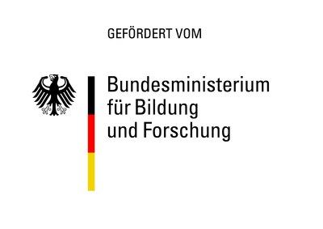

# BMBF Projekt *LLM-Praxis*

Laufzeit: 10/24 - 9/28

## Projektbeschreibung
TBA

## Partner:
## Forschungseinrichtungen
&nbsp;&nbsp;&nbsp;
## Industriepartner
TBA

## Kontakt
Prof. Janis Keuper  
Institute for Machine Learning and Analytics  
HS Offenburg  
*janis.keuper* -at- *hs-offenburg.de*   
